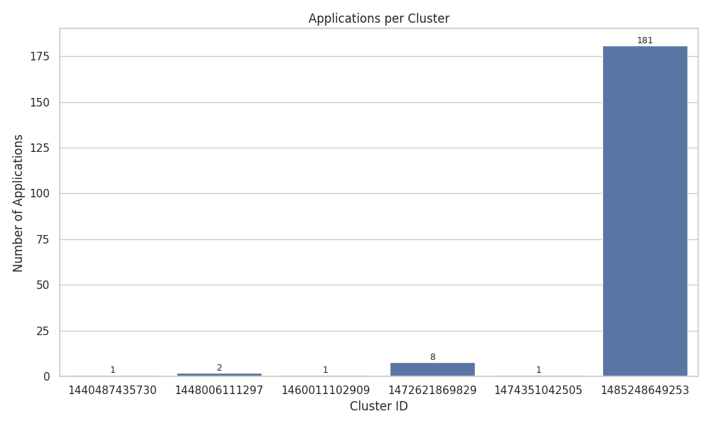
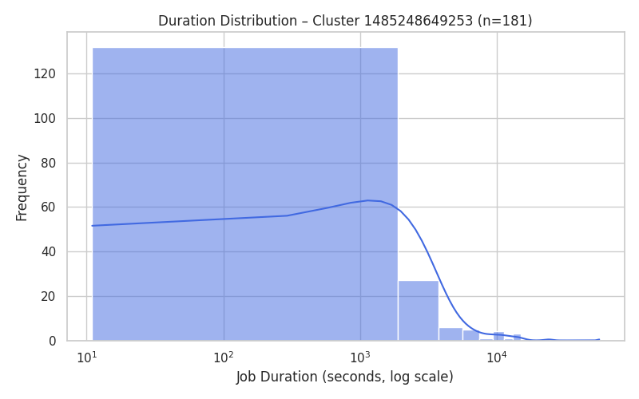
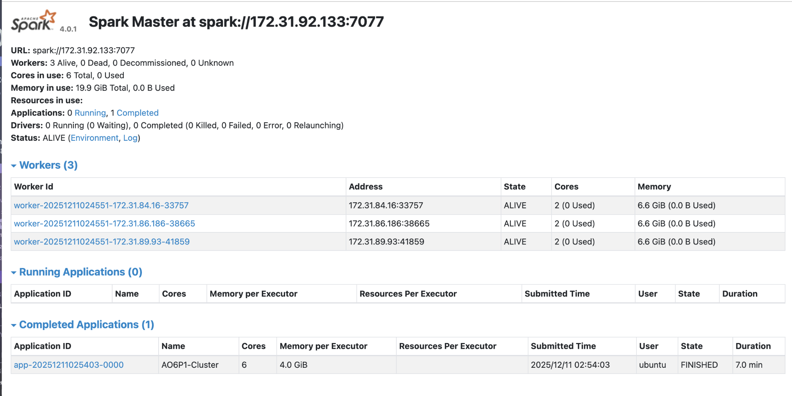
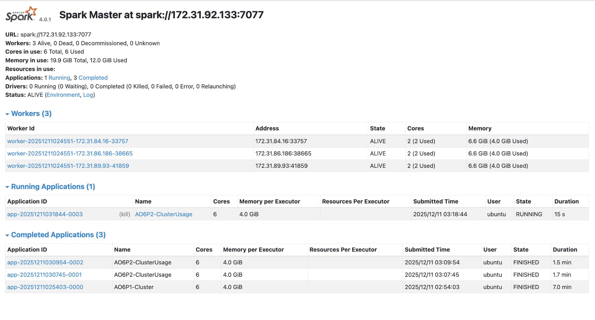
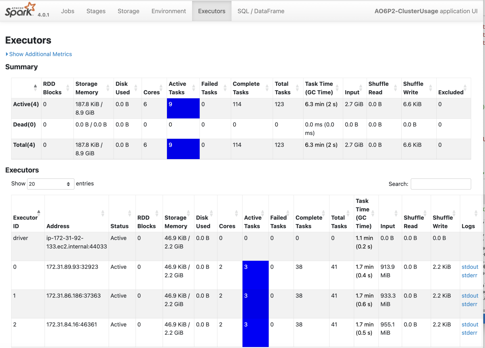
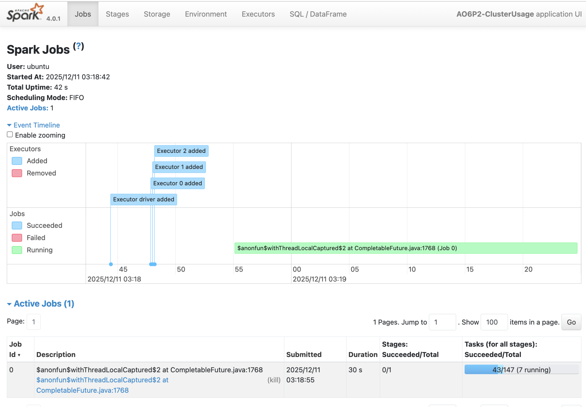
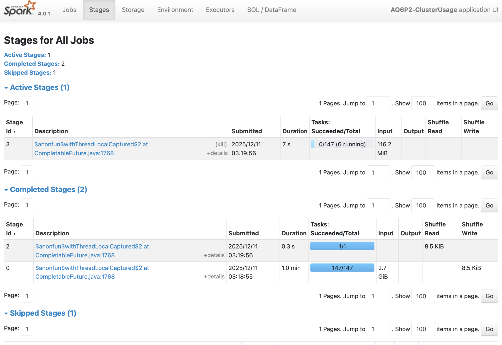

# Assignment 6: Spark Log Analysis on AWS Cluster - Danielle Fischer

Comprehensive analysis of findings (20 points)
Clear description of approach for each problem
Key insights and patterns discovered in the data
Discussion of cluster usage patterns and trends
Performance analysis (15 points)
Execution time observations
Optimization strategies employed
Comparison of local vs cluster performance
Documentation quality (10 points)
Screenshots of Spark Web UI showing job execution
Well-formatted markdown with clear sections
Professional presentation
Additional insights (5 points)
Novel visualizations beyond requirements
Deeper analysis of the data
Creative problem-solving approaches

# Overview

This report summarizes the analysis of ~2.8GB of real Spark cluster logs from 194 applications running on 6 YARN clusters between 2015 and 2017, totaling 3,852 container log files. The primary goals of the assignment were to set up and manage a multi node spark cluster, process large scale unstructured log data using PySpark, and extract meaningful operational insights from distributed systems logs. To accomplish this, the analysis focused on two major components:
1. Problem 1: log level analysis
    this stage parsed raw log lines to identify and quantify log severity levels (INFO, WARN, ERROR). the output characterizes the overall system stability and identifies the dominant sources of logging activity. representative samples and summary statistics were also extracted to illustrate the structure and content of parsed events
2. Problem 2: cluster usage analysis
    this stage reconstructed execution timelines for all 194 applications by extracting cluster IDs, application IDs, and timestamps from the directory structure and log messages. using these reconstructed timelines, the analysis summarized workload distirbution across the six clusters and explored application behavior thorugh visualizations

# Problem 1 - Log Level Distribution

## Approach
The goal of problem 1 was to process the container logs and analyze the distribution of log severity levels. This step required using the distributed spark cluster to efficiently parse and aggregate results. The approach consisted of three main tasks:
    1. log level extraction
    2. sampling of representative log lines
    3. summary statistics

## Results

**Log Level Counts**
*from problem1_counts.csv*
| log_level | count      |
| --------- | ---------- |
| **INFO**  | 27,389,482 |
| **ERROR** | 11,259     |
| **WARN**  | 9,595      |

INFO-level logging dominates overwhelmingly, accounting for nearly all logged events

**Sample of Parsed Log Lines**
*from problem1_sample.csv, truncated for readability*
| log_entry                                                        | log_level |
| ---------------------------------------------------------------- | --------- |
| 17/06/09 10:50:04 INFO executor.Executor: Running task…          | INFO      |
| 17/06/09 20:56:59 INFO python.PythonRunner: Times: total = 40…   | INFO      |
| 17/06/08 19:37:19 INFO storage.BlockManager: Found block rdd…    | INFO      |
| 17/06/07 12:22:11 INFO MemoryStore: Block broadcast_3 stored as… | INFO      |
| …                                                                | INFO      |

All sampled rows were INFO messages, which reflects the global distribution

**Summary Statistics**
*from problem1_summary.txt*
Total log lines processed: 33,236,604
Total lines with log levels: 27,410,336
Unique log levels found: 3

Log level distribution:
INFO  : 27,389,482 (99.92%)
ERROR : 11,259    (0.04%)
WARN  : 9,595     (0.04%)

## Key Insights and Patterns

1. Extremely high INFO-level volume

INFO messages account for 99.92% of all detected log level entries. This suggests that the spark executors were very verbose, most log activity reflects routine internal operations, and the system was not generating many warnings or errors in comparison to the info messages.

2. Very low WARN and ERROR rates

THe combined WARN and ERROR messages make up only 0.08% of all log level containing lines:
    * WARN: 9,595
    * ERROR: 11,259

This indicates high cluster stability, few task or executor failures, and smooth job scheduling and shuffle operations.

3. Logging behavior reflects normal executor lifecycles

The sample logs reveal repeated patterns characteristic of steady state spark execution: the executors starting and completing tasks, blockmanager registering and retrieving shuffle blocks, pythonruner reporting execution timings, memorystore events related to chaching and broadcasting. All fo tehse fall under expected patterns in spark workloads

4. Operational implications

Because INFO messages dominate nearly all log activity, most log storage cost is spent on noncritical messages. Debugging events could be difficult to isolate without filtering or indexing, and systems in production often reduce INFO loggin to avoid unnecessary log accumulation. Tuning verbosity could produce major storage savings. 

# Problem 2 - Cluster Usage Analysis

## Approach

Problem 2 analyzes how the spark cluster was used across all applications recorded in the YARN log bucket. The objective was to extract application timelines, quantify usage load across clusters, and visualize trends in job durations and cluster level utilization. To do this, the analysis followed four big main steps:
1. reading raw logs
2. extracting application timelines through parsing the log lines
3. creating summary tables (application timeline table, cluster summary table)
4. visualizing cluster behavior

## Results

**Application Timeline Table**
*from problem2_timeline.csv*
this file contains the full timeline of applicatoins, but for example here are a few of the lines:
| cluster_id    | application_id                 | app_number | start_time          | end_time            |
| ------------- | ------------------------------ | ---------- | ------------------- | ------------------- |
| 1440487435730 | application_1440487435730_0039 | 0039       | 2015-09-01 18:14:40 | 2015-09-01 18:19:50 |
| 1448006111297 | application_1448006111297_0137 | 0137       | 2015-09-01 18:14:40 | 2016-04-07 11:28:11 |
| 1448006111297 | application_1448006111297_0138 | 0138       | 2016-04-07 11:39:58 | 2016-04-07 12:22:08 |

this dataset serves as the basis for computing durations and cluster usage volume

**Cluster Summary Table**
*from problem2_cluster_summary.csv*

| cluster_id        | num_applications | cluster_first_app   | cluster_last_app    |
| ----------------- | ---------------- | ------------------- | ------------------- |
| **1485248649253** | 181              | 2017-01-24 17:00:28 | 2017-07-27 21:45:00 |
| **1472621869829** | 8                | 2016-09-09 07:43:47 | 2016-09-09 10:07:06 |
| **1448006111297** | 2                | 2016-04-07 10:45:21 | 2016-04-07 12:22:08 |
| **1474351042505** | 1                | 2016-11-18 22:30:06 | 2016-11-19 00:59:04 |
| **1440487435730** | 1                | 2015-09-01 18:14:40 | 2015-09-01 18:19:50 |
| **1460011102909** | 1                | 2016-07-26 11:54:20 | 2016-07-26 12:19:25 |

cluster 1485248649253 overwhelmingly dominates usage with 

**Stats Summary Table**
*from problem2_stats.txt*
| Metric                           | Value |
| -------------------------------- | ----- |
| **Total unique clusters**        | 6     |
| **Total applications**           | 194   |
| **Average applications/cluster** | 32.33 |

| Cluster ID        | Applications |
| ----------------- | ------------ |
| **1485248649253** | 181          |
| **1472621869829** | 8            |
| **1448006111297** | 2            |
| **1474351042505** | 1            |
| **1440487435730** | 1            |
| **1460011102909** | 1            |

**Bar Chart**

the bar chart clearly shows one extreme outlier cluster with very high activity (181 applications), while all others show minimal usage

**Duration Density Plot**

The duration distribution for Cluster 1485248649253 (n=181) shows:
    * most jobs finish in tens to hundreds of seconds
    * a long tail extending to 10,000+ seconds, indicating heavy or straggling jobs
    * log scaled x-axis shows skewness typical of production workloads

## Key Insights and Patterns

Cluster 1485248649253 completely dominates usage. It accounts for 93% of all aplications, and all other clusters combined contribute only 13 applications. This strongly suggests a single long running and highly utilized production cluster with additional clusters for short lived workloads.

The distribution is ont uniform, but instead extremely top heavy which reflects real world behaviors where one cluster is provisioned for ongoing batch workloads.

The most active cluster operated over a long window (january 2017 to july 2017), meanwhile many other clusters ran for a single day or even less time. 

The long right tail in the density plot reflects a mix of fast jobs and sporadic heavy jobs.

# Performance Analysis

Running the analysis pipeline on a three node spark cluster (each with 2 cores and ~6.6 GiB RAM) showed how spark distributes work and how job performance scales when working with so much log data and container files. The spark UI screenshots highlight several important aspects of execution behavior.

The spark master dashboard shows three healthy worker nodes, each contributing two cores, for a total of six distributed execution cores. During problem 2 (as seen in the screenshot), all workers were fully utilized, and the executors tab confirms that each worker received one executor and that all executors remained active throughout the job.

The spark jobs view shows that all tasks prior wer ecompleted successfully, and the event timeline shows executors being added immediately at job start, then all three workers running in parallel. This shows that the job benefitted from cluster parallelism in a balanced way.

# Additional Insights and Extensions

Across all six YARN clusters represented in the dataset, one cluster accounts for 181 out of 194 applications, or more than 93% of activity. The other clusters each contain 1-8 applications. This skew suggests a production environment with one long running shared cluster used heavily by multiple users or automated pipelines, and several ephemeral clusters used briefly, possibply for testing or running isolated workloads. 

The duration distirbution for this large cluster shows a long right tail, where most applications complete quickly but a minority run significantly longer. In real infrastructure this might reflect short, routine batch jobs forming the bulk of the workload and occassional longer ETL, ML training, or other longer sorts of jobs. 

If extended, this could incorporate executor level failure and restart analysis, per cluster metrics (like maybe jobs per day), job type classification, anomaly detection for unusually long runtimes, or correlation between log severity spikes and application failures. 

# Conclusion

This analysis shows how distributed processing with apache spark can transform large unstructured log corpora into structured insights about system performance, application lifecycle behavior, and cluster level workload patterns.

Problem 1 provided a baseline understanding of overall log composition, revealing that INFO level messages dominate the dataset (over 99%), with WARN and ERROR logs forming only a small fraction. This confirms that the logs represent routine system activity rather than failure heavy workloads.

Problem 2 connected individual container logs back to their clusters and applications, allowing the reconstruction of execution timelines and usage patterns across six YARN clusters. The resulting tables and visualizations highlight strongly skewed cluster usage, structured submission bursts, and large variability in job duration, showing patterns characteristic of real production Spark environments.

Performance analysis using the Spark UI demonstrated that the distributed cluster executed the analysis efficiently, fully utilizing all three workers, distributing tasks evenly, and completing thousands of log operations without failures or excessive shuffling. These findings reinforce the value of distributed computing for large scale text-based log analysis.

